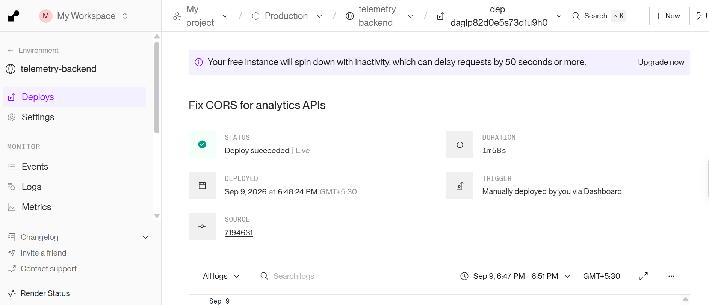
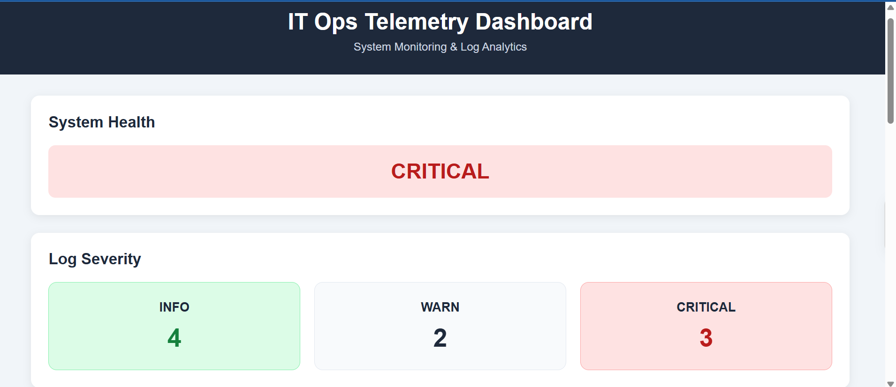
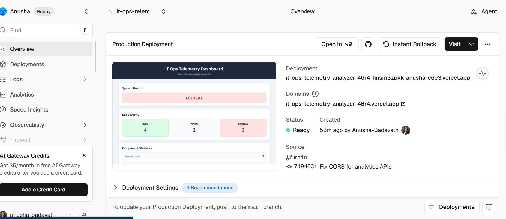

# IT Ops Telemetry Analyzer Prototype

Forward Deployed Engineer Assessment Project

# IT Ops Telemetry Analyzer

A full-stack IT Operations Telemetry Analyzer that parses operational log data, stores valid records in PostgreSQL, and provides real-time system health and telemetry analytics through a web dashboard.

## Project Overview

The IT Ops Telemetry Analyzer converts unstructured operational log data into structured and actionable information.

The application:

- Reads log data from `logs.txt`
- Parses logs using Java Regular Expressions
- Extracts timestamp, severity, system component, and log message
- Skips malformed log lines without crashing
- Stores valid logs in PostgreSQL
- Calculates severity statistics
- Calculates component statistics
- Identifies components generating critical events
- Determines overall system health
- Displays results through a responsive web dashboard
- Provides REST APIs for frontend communication

---

## Architecture

```text
                logs.txt
                   |
                   v
        +---------------------+
        |   Log Parser        |
        | Java Regex          |
        +---------------------+
                   |
                   v
        +---------------------+
        | Spring Boot Backend |
        | REST APIs           |
        +---------------------+
                   |
                   v
        +---------------------+
        |    PostgreSQL       |
        |   telemetry_logs    |
        +---------------------+
                   |
                   v
        +---------------------+
        | Frontend Dashboard  |
        | HTML/CSS/JavaScript |
        +---------------------+
        Tech Stack
Backend
Java 17
Spring Boot
Spring Data JPA
Maven
Regular Expressions

Database
PostgreSQL
Frontend
HTML5
CSS3
JavaScript
Fetch API
Responsive Flexbox/Grid

Deployment
Render - Backend & PostgreSQL
Vercel - Frontend
GitHub - Source Code

Features
1. Log Parsing

The application uses Java Regular Expressions to parse valid log entries.

Each valid log contains:

Timestamp
Severity
System Component
Log Message

example
2026-08-24 10:33:40 [CRITICAL] Payment-API - Transaction processing failed

2. Malformed Log Handling

Malformed records are safely skipped instead of crashing the application.
Example malformed record:
2026-08-24 10:33:40 [MALFORMED_LINE_TEST] Broken-Component-No-Data

The parser returns null for invalid records and the ingestion service logs a warning before continuing with the remaining records

3. PostgreSQL Storage

Valid parsed logs are stored in the telemetry_logs table.

Table structure:

Column	            Type
id               	BIGSERIAL
timestamp      	TIMESTAMP
severity        	VARCHAR
system_component	VARCHAR
log_message     	TEXT

Indexes are created for:

Severity
System Component
Timestamp

Analytics
The backend provides the following analytics:
Severity Statistics
INFO      4
WARN      2
CRITICAL  3

Component Statistics

The application counts telemetry records for each system component.

Critical Statistics
The application identifies components generating critical events.

System Health
System health is calculated based on log severity:
CRITICAL → At least one CRITICAL event exists
WARNING  → WARN events exist but no CRITICAL events
HEALTHY  → No WARN or CRITICAL events

REST API Endpoints
Get Logs

GET /api/logs

Returns all successfully parsed telemetry logs

Get Severity Statistics
GET /api/analytics/severity
okay
show like this

all wrong
ok na

Aahhh 😄 ippudu ardham ayyindi Anu! Nuvvu README.md lo images kindha display avvali ani antunnav — separate screenshots folder create cheyyadam gurinchi kaadu.

Yes ✅ README lo screenshots add cheyyachu. GitHub lo README open cheste project description kinda images kanipistayi.

Example:

## Dashboard


GitHub README lo ila render avtundi:

Dashboard

🖼️ nee dashboard screenshot

Manam add cheyyalsina sections
## Project Screenshots

### 1. Dashboard


### 2. Render Backend


### 3. PostgreSQL Database


Important: Images ni GitHub repository lo upload cheyyali; README lo aa image path ni reference chestham. Appudu README kinda images visible avutayi.

👉 Nee point correct. Separate page lo kaadu — README open chesinappudu content kinda screenshots kanipinchela chestham.

Next manam README ni complete professional ga prepare cheddam, screenshots place kuda include chesi.

ok read me pamu

Sure Anu. Nee project ki direct ga GitHub README.md lo paste cheyyagalige complete README idi.

# IT Ops Telemetry Analyzer

A full-stack IT Operations Telemetry Analyzer that parses operational log data, stores valid records in PostgreSQL, and provides real-time system health and telemetry analytics through a web dashboard.

## Project Overview

The IT Ops Telemetry Analyzer converts unstructured operational log data into structured and actionable information.

The application:

- Reads log data from `logs.txt`
- Parses logs using Java Regular Expressions
- Extracts timestamp, severity, system component, and log message
- Skips malformed log lines without crashing
- Stores valid logs in PostgreSQL
- Calculates severity statistics
- Calculates component statistics
- Identifies components generating critical events
- Determines overall system health
- Displays results through a responsive web dashboard
- Provides REST APIs for frontend communication

---

## Architecture

```text
                logs.txt
                   |
                   v
        +---------------------+
        |   Log Parser        |
        | Java Regex          |
        +---------------------+
                   |
                   v
        +---------------------+
        | Spring Boot Backend |
        | REST APIs           |
        +---------------------+
                   |
                   v
        +---------------------+
        |    PostgreSQL       |
        |   telemetry_logs    |
        +---------------------+
                   |
                   v
        +---------------------+
        | Frontend Dashboard  |
        | HTML/CSS/JavaScript |
        +---------------------+
Tech Stack
Backend
Java 17
Spring Boot
Spring Data JPA
Maven
Regular Expressions
Database
PostgreSQL
Frontend
HTML5
CSS3
JavaScript
Fetch API
Responsive Flexbox/Grid
Deployment
Render - Backend & PostgreSQL
Vercel - Frontend
GitHub - Source Code
Features
1. Log Parsing

The application uses Java Regular Expressions to parse valid log entries.

Each valid log contains:

Timestamp
Severity
System Component
Log Message

Example:

2026-08-24 10:33:40 [CRITICAL] Payment-API - Transaction processing failed
2. Malformed Log Handling

Malformed records are safely skipped instead of crashing the application.

Example malformed record:

2026-08-24 10:33:40 [MALFORMED_LINE_TEST] Broken-Component-No-Data

The parser returns null for invalid records and the ingestion service logs a warning before continuing with the remaining records.

3. PostgreSQL Storage

Valid parsed logs are stored in the telemetry_logs table.

Table structure:

Column	Type
id	BIGSERIAL
timestamp	TIMESTAMP
severity	VARCHAR
system_component	VARCHAR
log_message	TEXT

Indexes are created for:

Severity
System Component
Timestamp
Analytics

The backend provides the following analytics:

Severity Statistics
INFO      4
WARN      2
CRITICAL  3
Component Statistics

The application counts telemetry records for each system component.

Critical Statistics

The application identifies components generating critical events.

System Health

System health is calculated based on log severity:

CRITICAL → At least one CRITICAL event exists
WARNING  → WARN events exist but no CRITICAL events
HEALTHY  → No WARN or CRITICAL events
REST API Endpoints
Get Logs
GET /api/logs

Returns all successfully parsed telemetry logs.

Get Severity Statistics
GET /api/analytics/severity
Returns log counts grouped by severity

Get Component Statistics
GET /api/analytics/components
Returns log counts grouped by system component.


Get Critical Statistics
GET /api/analytics/critical
Returns critical event counts grouped by system component

Get System Health
GET /api/analytics/health
Returns the current overall system health.


Project Structure
it-ops-telemetry-analyzer/
│
├── backend/
│   ├── src/
│   │   └── main/
│   │       └── java/
│   │           └── com/
│   │               └── telemetry/
│   │                   └── analyzer/
│   │                       ├── controller/
│   │                       ├── model/
│   │                       ├── parser/
│   │                       ├── repository/
│   │                       └── service/
│   │
│   ├── Dockerfile
│   ├── pom.xml
│   └── logs.txt
│
├── database/
│   └── schema.sql
│
├── frontend/
│   ├── index.html
│   ├── style.css
│   └── script.js
│
├── logs.txt
└── README.md

Local Setup
Prerequisites

Install:

Java 17
Maven
PostgreSQL
Git

1. Clone the repository
git clone https://github.com/Anusha-Badavath/it-ops-telemetry-analyzer.git

cd it-ops-telemetry-analyzer

2. Create PostgreSQL Database
Create a database named:
telemetry_analyzer

Then execute:
database/schema.sql

3. Configure Environment Variables

The backend uses environment variables for database configuration.

DB_URL
DB_USER
DB_PASSWORD

Example:

DB_URL=jdbc:postgresql://localhost:5433/telemetry_analyzer
DB_USER=your_database_user
DB_PASSWORD=your_database_password

Do not commit database passwords or other secrets to GitHub.

4. Run Backend

Go to:

cd backend

Build:

mvn clean package

Run:

mvn spring-boot:run

Backend runs on:

http://localhost:8080
5. Run Frontend

Open the frontend folder using VS Code Live Server.

Example:

http://127.0.0.1:5500

The frontend communicates with the Spring Boot REST APIs using JavaScript Fetch API.

Docker

The backend includes a multi-stage Dockerfile.

Build the Docker image:

docker build -t telemetry-analyzer ./backend

Run the container:

docker run -p 8080:8080 telemetry-analyzer
Deployment
Backend

The Spring Boot backend is deployed using Render.

Backend:

https://telemetry-backend-57ll.onrender.com
Frontend

The frontend is deployed using Vercel.

Production frontend:

https://it-ops-telemetry-analyzer-6z91.vercel.app

Dashboard

The dashboard displays:

Overall System Health
Log Severity Statistics
Component Statistics
Critical Event Statistics
Parsed Log Records

The dashboard updates data asynchronously using the JavaScript Fetch API without requiring a full page refresh.

Error Handling

The application follows defensive parsing principles.

If a log line is malformed:

Invalid log → Skip record → Log warning → Continue processing

Therefore, a single corrupted log record does not stop the entire ingestion process.

Database Schema

The database schema is available in:

database/schema.sql

The schema creates the:

telemetry_logs

table along with indexes for commonly queried columns.

Future Improvements

Possible future improvements include:

Scheduled/continuous log ingestion
Pagination for large log datasets
Advanced filtering and search
Authentication and authorization
Historical health trends
Charts and visual analytics
Automated CI/CD pipeline
Automated unit and integration testing


## Project Screenshots

### Dashboard


### Vercel Deployment


### Render Backend
